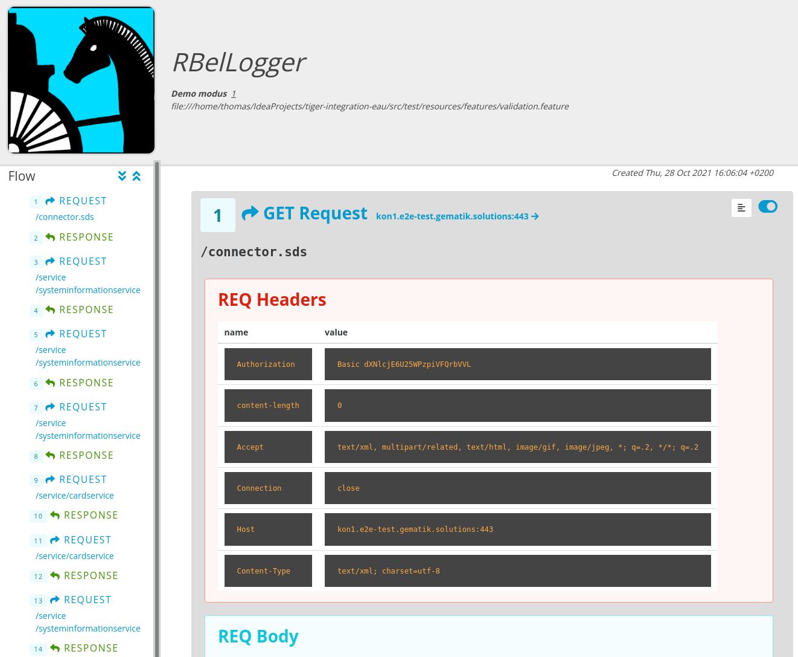

=  EAU Konnektor Validierungstestsuite
:toc: 1
:icons: font
:icontype: svg

== Übersicht

Um den Datenverkehr zwischen Primärsystem und Konnektor mitzuprotokollieren, werden im Rahmen der Validierungstestsuite
eine Reihe von Tiger Proxy Instanzen gestartet, welche als Reverse Proxy, den Zugang zu den
in der RU verfügbaren Konnektoren ermöglichen.
Die Tigerproxies zeichnen alle Datennachrichten auf und stellen deren Inhalte übersichtlich
als strukturierten HTML Bericht dar.

Um einen bestimmten Konnektor anzusprechen, müssen Sie folgende ZugriffsURL auf ihrem Primärsystem konfigurieren:

* Konnektor 1 Koco (kon**24**.e2e-test.gematik.solutions) erreichbar über *http*://127.0.0.1:11**1**10
* Konnektor 2 RISE (kon**26**.e2e-test.gematik.solutions) erreichbar über *http*://127.0.0.1:11**2**10
* Konnektor 3 RISE (kon**28**.e2e-test.gematik.solutions) erreichbar über *http*://127.0.0.1:11**3**10
* Konnektor 4 Secunet (kon**29**.e2e-test.gematik.solutions) erreichbar über *http*://127.0.0.1:11**4**10
* Konnektor 5 Secunet (kon**31**.e2e-test.gematik.solutions) erreichbar über *http*://127.0.0.1:11**5**10

=== Netzwerkdiagramme


== Systemanforderungen

Sie benötigen für das Ausführen der Validierungstestsuite folgende Programme installiert auf Ihrem System:

* *Java Open JDK 11* (z.B. https://www.openlogic.com/openjdk-downloads?field_java_parent_version_target_id=406&field_operating_system_target_id=All&field_architecture_target_id=All&field_java_package_target_id=396[von hier])
* *Maven* latest
* (Optional) *GIT* (z.B. https://git-scm.com/downloads[von hier])

Zusätzlich benötigen sie mindestens 24GB RAM (32GB empfohlen). Stellen sie sicher, dass außer dem PS keine Programme laufen, wenn sie den Test ausführen!


== Installation der Validierungstestsuite

Um die Testsuite auf Ihrem Rechner nutzen zu können müssen Sie dieses Git Repo auf Ihrem Rechner auschecken/klonen

[source,shell script]
----
 # NOT SUPPORTED AS OF NOW!
 git clone https://github.com/gematik/tiger-eau-proxy.git
----

== Konfiguration der Validierungstestsuite

Nachdem Sie die, von der Gematik ausgestellten Zugriffsdaten (Account, Passwort) erhalten haben, setzen sie in der Konsole in welcher sie das mvn Kommando absetzen die environment Variablen entsprechend.
 Alternativ ersetzen Sie bitte in der pom.xml im Bereich `<properties>` die Einträge für Benutzer und Passwort entsprechend mit ihren Werten:

[source,xml]
----
<gematik.user>${env.GEMATIK_USER}</gematik.user>
<gematik.password>${env.GEMATIK_PASSWORD}</gematik.password>
----

=== Direkter Zugriff auf den Gematik Gateway Server

Wenn Sie direkten Zugriff auf das Internet und den Gematik Gateway server haben, so sind *KEINE* weiteren Anpassungen notwendig.

=== Zugriff auf den Gematik Gateway Server über den Firmen Proxy

Wenn Sie über einen Firmenproxy ins Internet gehen, so müssen Sie bei den mvn Aufrufen in den folgenden Kapiteln noch die beiden properties https.proxyHost und https.proxyPort auf die in ihrem Firmennetzwerk gültigen Werte setzen.

[source,shell]
----
mvn -Dhttps.proxyHost=....... -Dhttps.proxyPort=..... -P Test
----

== Testablauf

Im Rahmen der Validierungstests werden das Signieren und das Verifizieren eines Dokumentes an jedem einzelnen Konnektor
mit jedem anderen (aber auch mit sich selbst) Konnektor durchgetestet.
Dies bedeutet, dass Sie pro Testszenario Ihr Primärsystem *mehrmals* umstellen müssen.

Für das erste Szenario müssen Sie zuerst den kon1 konfigurieren, dann ein Dokument signieren.
Nun müssen Sie beginnend mit kon1 bis kon6 jedesmal den Konnektor konfigurieren und
das signierte Dokument vom aktuellen Konnektor verifizieren lassen.

Dieses Szenario ist für die Konnektoren kon2 - kon6 zu wiederholen.
In Summe sind dies 6 Signierschritte mit je 6 Verifikationsschritten.


== Start des Demomodus

In diesem Modus werden zwar alle Nachrichten mitprotokolliert aber keine Validierungsprüfungen durchgeführt.
Dieser Modus eignet sich dazu in einem ersten Schritt die Kompatibilität Ihres Systems grundsätzlich zu prüfen.
Bitte stellen Sie sicher, dass das java Executable (java.exe oder java) und
das Maven Executable in Ihrem Ausführungspfad gefunden wird.

[source,shell]
----
cd tiger-integration-eau
mvn -P Demo
----

Durch Eingabe von *quit* und Eingabetaste wird der Demomodus beendet und
die mitprotokollierten Nachrichten werden im Verzeichnis _target/rbellogs_ als HTML Datei abgelegt.

== Ausführen von konnektorspezifischen Teilen der Valdidierungstestsuite

[source,shell]
----
cd tiger-integration-eau
mvn -P Kon1
----

Sie können durch Verwendung von ```Kon1``` bis ```Kon5``` hier nur den Teil der Testsuite ausführen, welcher das Signieren des jeweiligen Konnektors mit der Verifikation durch alle anderen Konnektoren überprüft.

== Starten der Validierungstestsuite

Nach einer erfolgreichen grundsätzlichen Prüfung der Kompatibilität im Demo Modus,
können Sie den eigentlichen Validierungstestlauf durch folgenden Aufruf starten:

[source,shell]
----
cd tiger-integration-eau
mvn -P Test
----

Nun startet die Validierungstestsuite die Testumgebung und im Anschluss dann den Webbrowser Ihres Rechners.
Auf der dargestellten Webseite werden sie nun durch den Validierungsprozess geführt.


Anbei noch der gesamte Workflow im Überblick


== Testbericht

Unter _target/site/serenity/index.html_ finden Sie nach Abschluss des Testlaufs einen detaillierten Testbericht
zu den einzelnen Testszenarien und - schritten.

=== Übersicht


=== Navigation zu den Teststeps

Durch Auswahl des "Test Results" Tabs gelangen Sie zur Liste der Testszenarien


Durch Auswahl eines Szenarios in der *MITTLEREN* Spalte gelangen Sie zur Detailansicht wo die einzelnen Testschritte und ihr Status aufgelistet sind.


=== Testevidenzen / Nachrichtenprotokolle

Aus der Übersichtsseite können sie im Evidence Tab alle mitgelesenen Nachrichten als RbelLog HTML Datei öffnen


In der sich öffnenden Seite können Sie die einzelnen Nachrichten nun detailliert analysieren.



Sollten Sie den Testlauf abgebrochen haben und keinen Testbericht vorfinden, so können Sie mit folgendem Kommando
den Testbericht für den abgebrochenen Testlauf erstellen.

[source,shell]
----
mvn serenity:aggregate serenity:reports
----


== Graphische Oberfläche

Um die Nachrichten der Validierungstestsuite in Echtzeit zu sehen und Fehler schnell erkennen zu können,
ist eine Weboberfläche unter folgender URL erreichbar:

[source,http request]
----
http://127.0.0.1:11000/webui
----

Die Nachrichten werden im RbelLog Format, identisch zu den Testevidenz-Dateien dargestellt.

=== Menüleiste (Unten)


Mit den entsprechenden Knöpfen können sie die folgenden Aktionen auslösen:

* "Routes" … mit diesem Knopf könnten Sie die Routen des Proxies anpassen. Bitte nicht modifizieren!
* "Scroll Lock" … mit diesem Knopf können Sie die aktuelle Ansicht sperren. Neu eingelangte Verkehrsdaten werden zwar mitprotokolliert und auch am Ende der Liste angehängt. Lediglich das automatische nach Unten Scrollen wurde deaktiviert.
* "Filter" … mit diesem Knopf können die aufgelisteten Nachrichten gefiltert werden.
* "Reset" … mit diesem Knopf können die bisher protokollierten Verkehrsdaten gelöscht werden.
* "Save" … mit diesem Knopf können die bisher protokollierten Verkehrsdaten als Traffic bz.w HTML Datei gespeichert werden.
* "Page X" … hier können Sie bei einer höheren Zahl an Nachrichten Seite für Seite durch alle Nachrichten durchblättern
* "Import" … erlaubt das Laden von als Traffic" gespeicherter Verkehrsdaten. Als HTML gespeicherte Daten können nicht importiert werden.
* "Quit" … mit diesem Knopf kann der Tiger Proxy beendet werden. Bitte nicht nutzen!


== Übermitteln Ihres Testberichts

Nach erfolgreichem Testdurchlauf müssen Sie das lokal im target Verzeichnis abgelegte ZIP Archiv mit dem Namen `tiger-integration-eau-.....-report.zip`
in der Titus Plattform hochladen, um das Bestätigungsverfahren fortzusetzen.

**ACHTUNG** Durch den Aufruf von `mvn` wird das `target` Verzeichnis gelöscht. Es empfiehlt sich das erstellte Report ZIP Archiv vorher in ein anderes Verzeichnis zu sichern.

 _Tiger is a test platform provided by Gematik GmbH_
